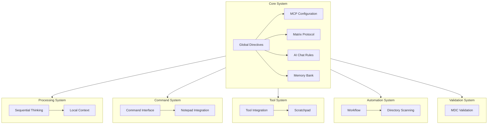

# System Patterns: KleoSr Cursor Rules System

## System Architecture

The KleoSr Cursor Rules System employs a layered architecture with distinct components that work together to provide a comprehensive development framework:

## Key Technical Decisions

### 1. MDC Format for Rule Documentation
The system uses Markdown-based MDC files for rule documentation, providing a balance between human readability and machine processability. Each MDC file includes YAML frontmatter with metadata that controls how and when rules are applied.

### 2. Directory-Based Organization
Rules are organized in a semantic directory structure that groups related components, making the system more maintainable and extensible.

### 3. Phase-Based Development Workflow
The Matrix Protocol implements a strict phase-based approach to development, separating concerns and ensuring comprehensive documentation and validation.

### 4. Command-Based Interface
The system uses a standardized command syntax for operations, providing consistent access to functionality across different contexts.

### 5. Memory Bank for Persistence
The Memory Bank architecture provides structured documentation that persists across sessions, ensuring context continuity.

## Design Patterns

### 1. Observer Pattern
The system implements variations of the observer pattern for monitoring and responding to changes in the development environment.

### 2. Command Pattern
The command system encapsulates operations as structured commands, allowing for consistent execution and history tracking.

### 3. Repository Pattern
The Memory Bank implements a repository pattern for documentation, with clear hierarchical relationships between documents.

### 4. Strategy Pattern
The Matrix Protocol uses different strategies (phases) for different stages of development, each with its own constraints and operations.

### 5. Facade Pattern
The command interface provides a simplified facade over the complex underlying functionality, making the system more accessible.

## Component Relationships

### Memory Bank Integration
The Memory Bank provides context to all other components, particularly the Matrix Protocol which uses this context for development decisions.

### Matrix Protocol and Command System
The Matrix Protocol defines the operational boundaries, while the Command System provides the interface to transition between these boundaries.

### MCP Configuration and Processing
The MCP Configuration optimizes AI performance, which directly impacts the effectiveness of the Sequential Thinking and Local Context processing systems.

### Tool Integration and Automation
The Tool Integration system provides interfaces to external tools, which the Automation system leverages for workflow automation.

### Validation and Documentation
The Validation system ensures the integrity of the documentation maintained by the Memory Bank and rules documented in MDC files.

This document should be updated when architectural decisions change or when new components are added to the system. 